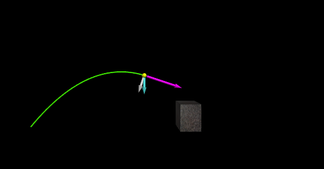

# Golf-Ball-Trajectory-Analysis-and-Simulation
This project combines theoretical calculations with a dynamic GlowScript simulation to analyze the trajectory of a golf ball launched by a golfer. Using Web VPython 3.2, the simulation incorporates a detailed representation of the golf ball's motion, the ground, and a building.

